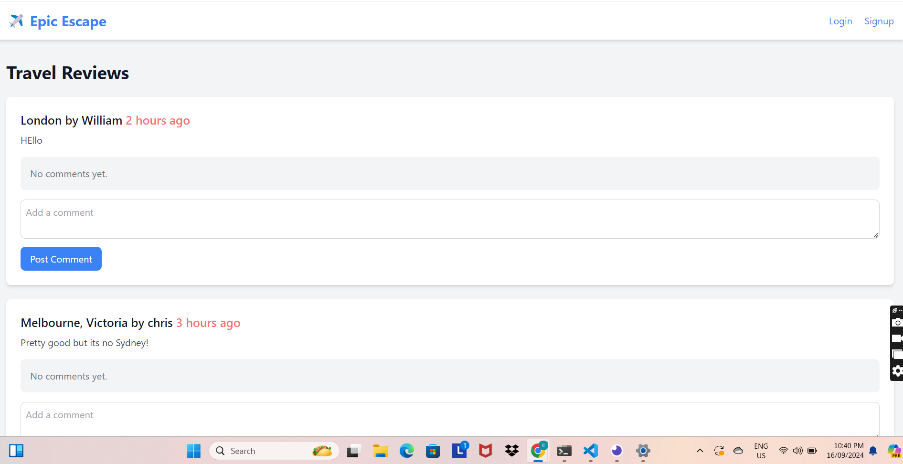
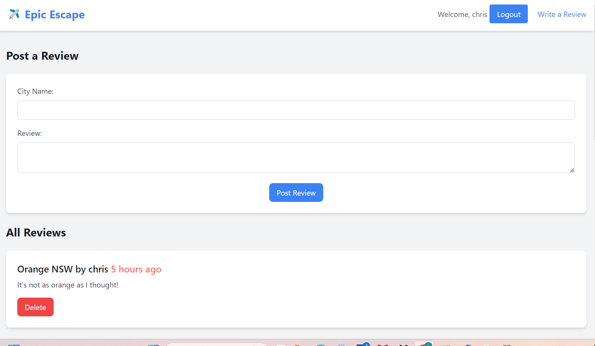

# EpicEscapes
Welcome to **Epic Escapes**, your ultimate travel blogging platform where you can read, post, and comment on yours and other user's blog posts 

Deployed web application URL: https://travel-planner-r3fr.onrender.com

## Description

Our cutting-edge blog platform empowers travel aficionados to express their impressions on diverse travel spots while also providing the opportunity to interact with and comment on fellow users' posts.

Experience the versatility of Epic Escapes by immersing yourself in a platform where you can read, publish, and engage in conversations about your preferred travel destinations.

## Github Repository 

https://github.com/ChrisReynolds0508/epic-escapes

## Technologies Utilised

[PostgreSQL](https://www.postgresql.org/)
[Bootstrap](https://getbootstrap.com/)

## Credits

Chris Reynolds  https://github.com/ChrisReynolds0508

Adriana Janikova  https://github.com/adrianajani

Yucheng Wang  https://github.com/William-figure

Ashley Cowan https://github.com/Ashley55mv

## License

Please refer to the license in repo

## How to Contribute

We welcome contributions to BeatBrowser! If you have suggestions for new features, improvements, or bug fixes, please open an issue or submit a pull request.

